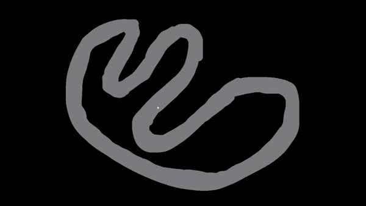

# RL-CarGameAI
A Reinforcement Learning car game AI

This is a Deep Neural Network based Reinforcement Learning program that successfully a car game called game_v1.

## The game: 
A staggeringly simple physics game where a point unit mass is to be navigated on a course.
The course has 2 types of positions: On-track and Off-track. The aim is to never collide with the on-track/off-track interface,
and drive.

The game ball starts at a random legal position, with zero speed. The sampling frequency (in Hz) needs to be supplied.
After this, for each play of the game, the user supplies the forces to be applied, in the cartesian coordinate system, 
and the game updates the position and state of the ball.
The 'Car' object plays the role of the said ball, likewise the 'Track' of the course.
Car object has a boolean attribute collided_on_last, which returns True if the 'car' collided on the last move

## v1 specifics
For v1, the environment was retricted so as to
1. Have the ball maintain a constant speed.
2. Apply forces in directions either parallel or transverse to the direction of the velocity of the car.

The aim for the agent was to navigate at this constant speed without colliding.

## v2 specifics
For v2, the restrictions of v1 were relaxed.
1. We affix the max speed allowed and the maximum force magnitudes. 
1. The controls available are throttle and steering, both between -1 and 1, qunatized.

### Trained AI gameplay:

